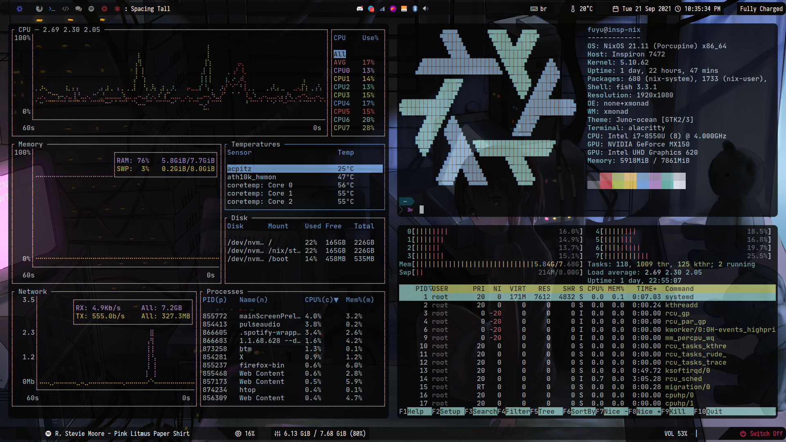
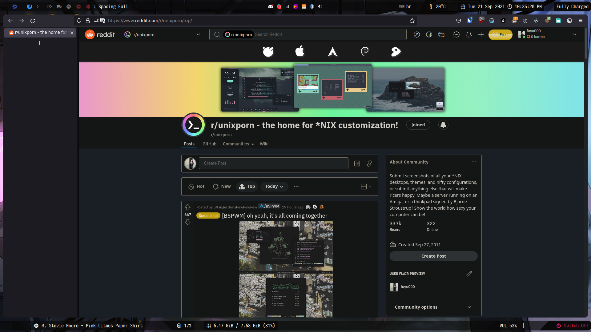
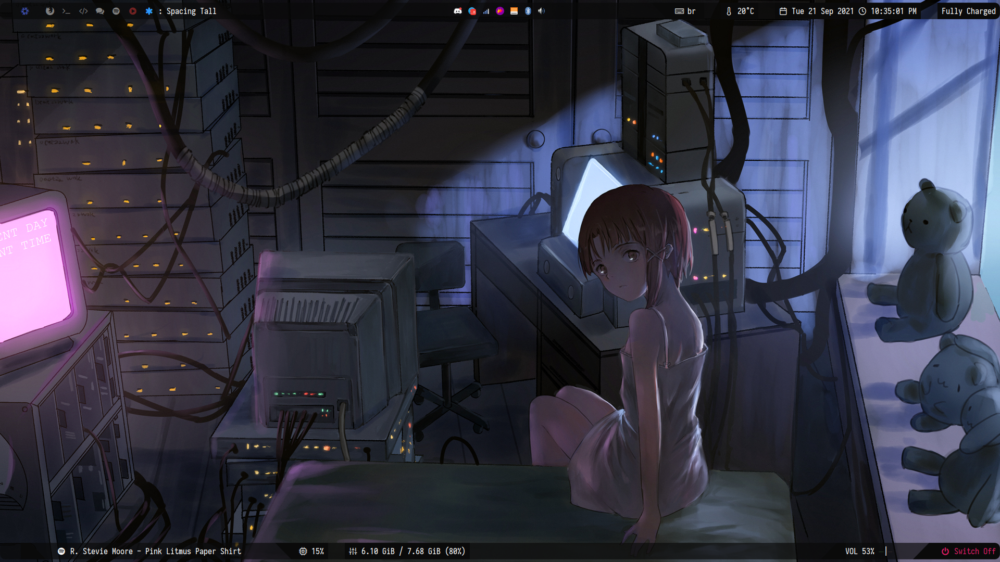

dotfiles
==========

configuration files for my operating system (still a work in progress). these are pretty specific to my needs and taste, but you may find something useful.

 ## screenshots
 

