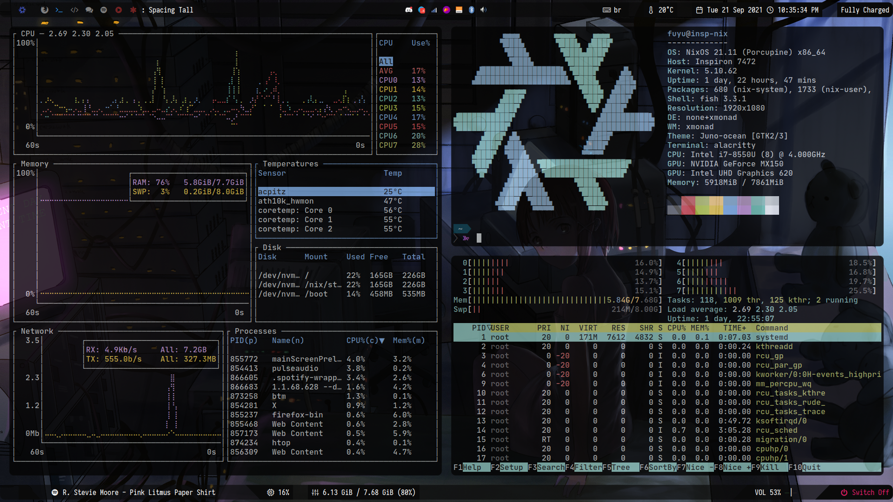
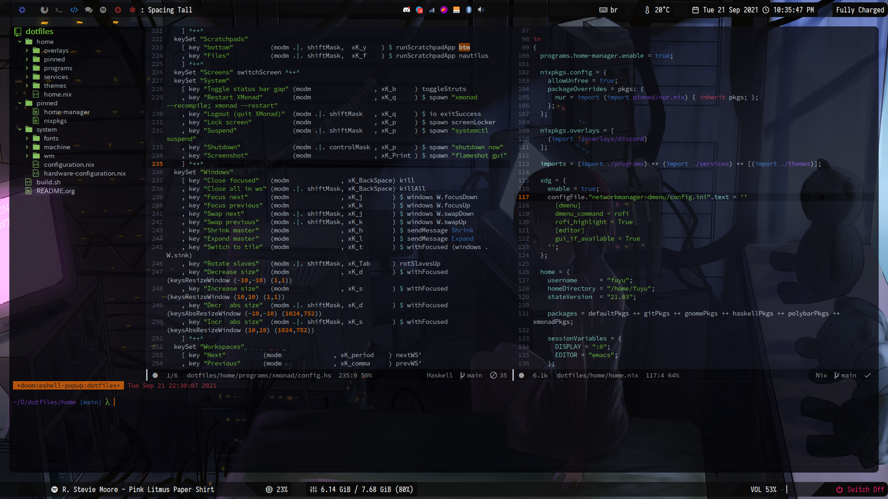
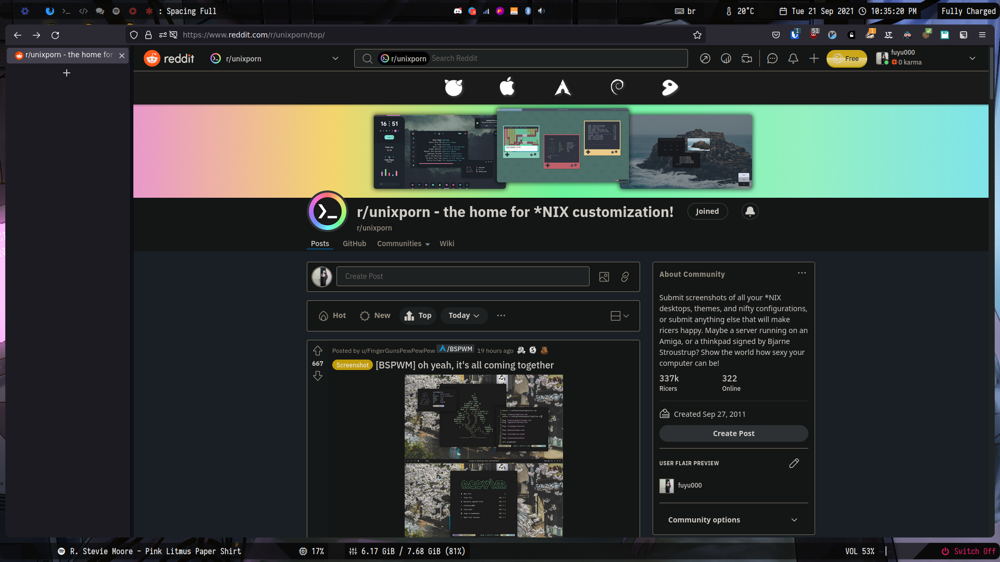
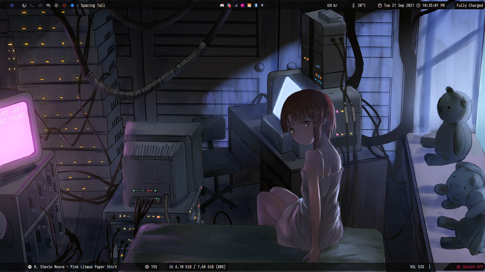

dotfiles
==========

configuration files for my operating system (still a work in progress). these are pretty specific to my needs and taste, but you may find something useful.

## usage

rebuild from this directory — it is the source of truth:

```bash
cd ~/dotfiles
./rebuild.sh switch laptop
```

see [OPERATIONS.md](OPERATIONS.md) for the preflight checks, recovery from a bad
generation, and machine-specific notes (thinkpad `/` key, media keys, polybar).

 ## screenshots
 







